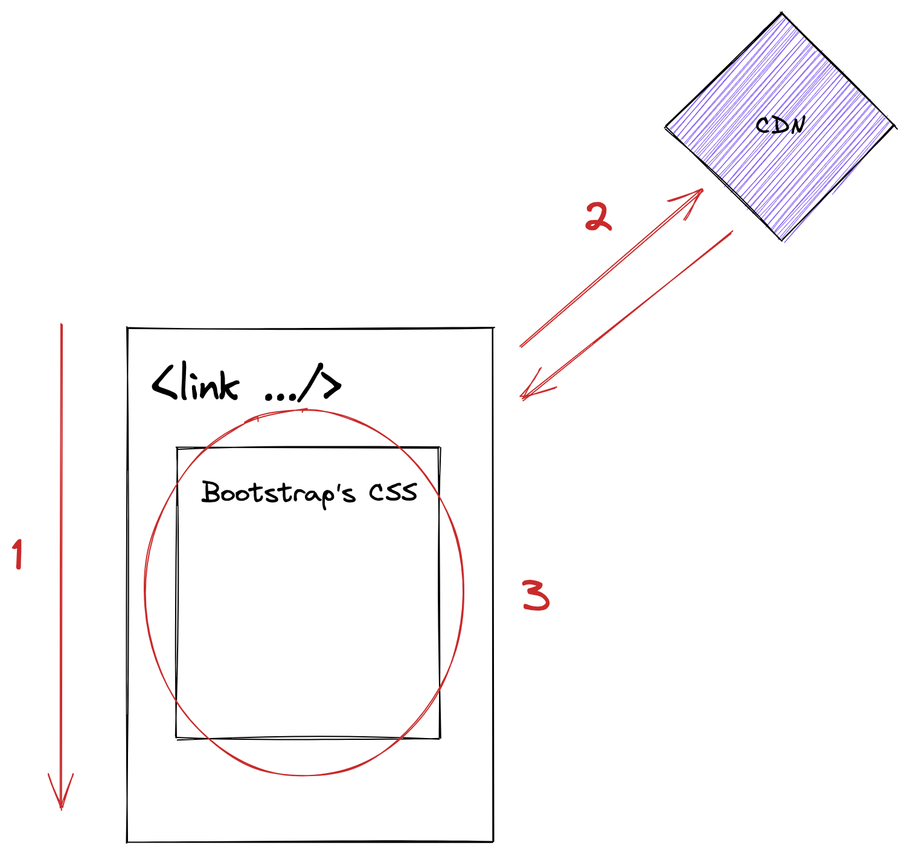

# Instalación Bootstrap

## Descargar unicamente CSS

```html
<!DOCTYPE html>
<html lang="en">
  <head>
    <meta charset="utf-8" />
    <title>My Page</title>
    <link
      href="https://cdn.jsdelivr.net/npm/bootstrap@5.2.0/dist/css/bootstrap.min.css"
      rel="stylesheet"
      integrity="sha384-gH2yIJqKdNHPEq0n4Mqa/HGKIhSkIHeL5AyhkYV8i59U5AR6csBvApHHNl/vI1Bx"
      crossorigin="anonymous"
    />
  </head>
  <body></body>
</html>
```

::: details Explicación visual


:::
