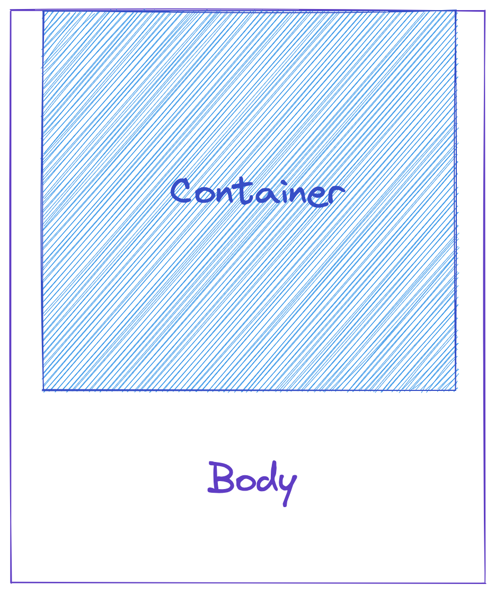
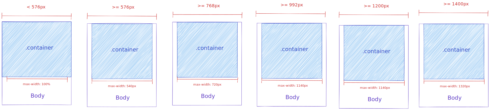
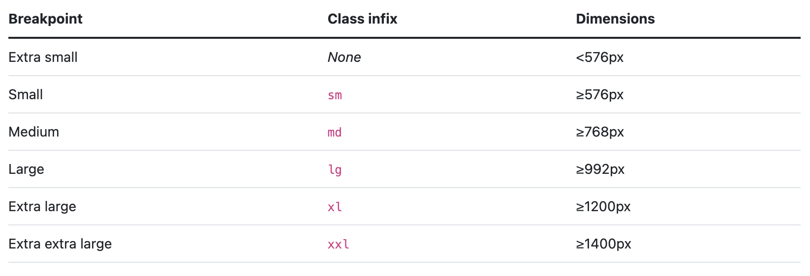
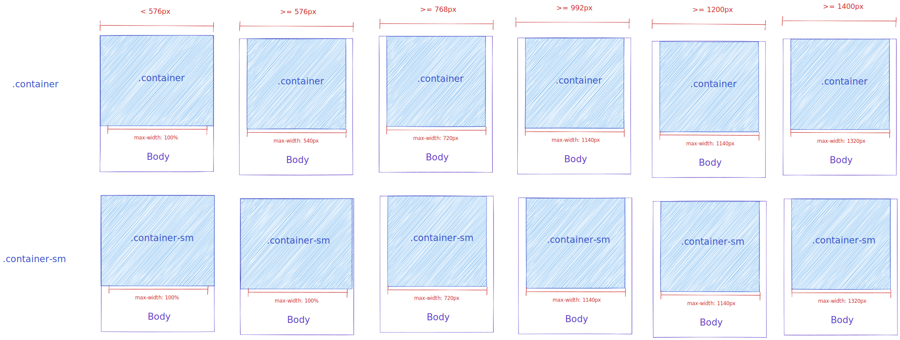
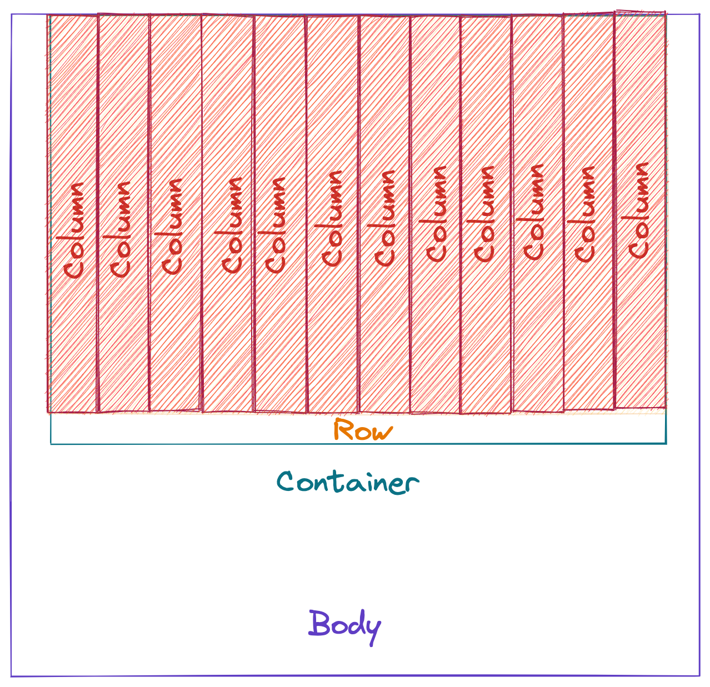
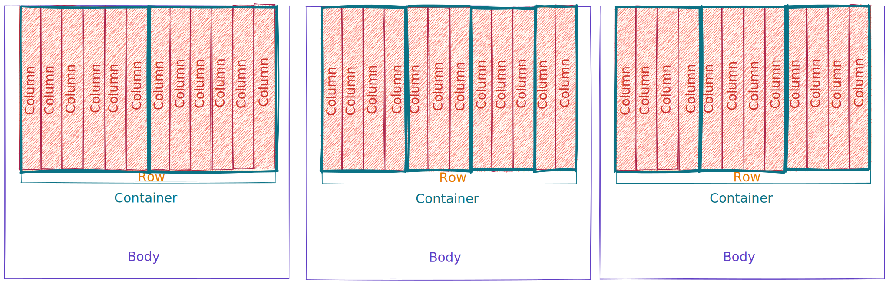

# Layout

## Container

Son el elemento más básico de Bootstrap y son **necesarios para usar el sistema de rejilla**. Son usados para contener, rellenar y a veces centrar contenido dentro de ellos. Pueden anidarse pero no siempre es necesario.<sup>[1]</sup>



Todos los contenedores son responsivos cambiando su `max-width` en cada _breakpoint_<sup>[2]</sup> y dependiendo del prefijo de la clase. El siguiente diagrama muestra la clase `.container` que cuyo `max-width` es de 100% en dispositivos menores a 576px y que después cambia con base en cada breakpoint.



:::tip En palabras sencillas
Sirven para alinear nuestro contenido y tienen un ancho determinado dependiendo del _breakpoint_.
:::

## Breakpoints

Son anchos personalizables que determinan como se comporta el diseño en varios dispositivos y tamaños de viewport en Bootstrap. Por defecto tienen los siguientes valores.

<sup>[3]</sup>

Estos se utilizan a manera de _infijos_ (van a la mitad del nombre de la clase) e.j. `text-md-blue`.

Son _mobile first_, esto quiero decir por defecto funcionan con el _breakpoint_ más pequeño y van modificando los estilos para dispositivos más grandes al agregar los infijos.

Es decir, suponiendo que tenemos la case `.text-red` que cambiar el color del texto a rojo, esa clase afectaría desde el dispositivo más pequeño hasta el más grande. En cambio si usáramos `.text-lg-red`, solo veríamos el text rojo en dispositivos con un _viewport_ >= 992px.

Las clases se pueden acumular para cambiar el comportamiento del diseño, si tuviéramos

```html
<p class="text-red text-lg-blue">Hola</p>
```

En dispositivos más pequeños y <992px tendríamos texto rojo, en dispositivos >= 992px tendríamos texto azul.

:::tip En palabras sencillas
Puedes pensarlos como _medias queries_ insertados en los nombres las clases. `clase-lg` sería cómo `@media (min-width: 992px){}`.
:::

### Ejemplo _breakpoints_ en clase `.container`



## Grid System

Sistema de 12 columnas habilitado en Bootstrap implementado en Flexbox.

::: warning ¡Atención!
Para usar el grid system tienes que user `.container` y `.row`
:::



Tienes acceso a 12 columnas que puedes utilizar a tu discreción. Para hacer tus diseños el número de columnas siempre tiene que sumar 12, es decir, puedes ocupar:

- 6 y 6
- 4, 3, 3 y 2
- 4, 4, 4



La forma de determinar el número de columnas que quieres es `col-{n}` donde `n` es un número, e.j. `col-6`, `col-12`.

Esto también se puede mezclar con los _infijos_ de los `breakpoints` e.j. `col-lg-6`. Siguiendo los principios de _mobile first_ de Bootstrap, utilizar `col-{n}` te dará el número de columnas desde el dispositivo más pequeño hasta el más grande.

[1]: https://getbootstrap.com/docs/5.2/layout/containers/#how-they-work
[2]: https://getbootstrap.com/docs/5.2/layout/containers/#how-they-work
[3]: https://getbootstrap.com/docs/5.2/layout/breakpoints/#available-breakpoints
